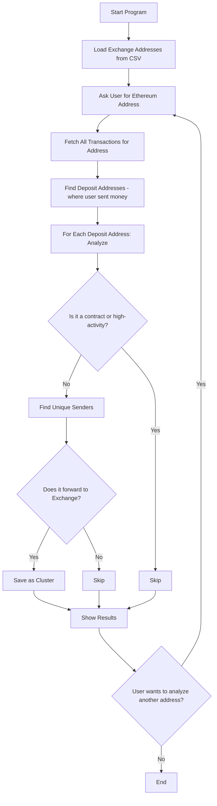

# Ethereum Deposit Clustering Tool

## Introduction

This tool helps you analyze Ethereum blockchain addresses to find groups ("clusters") of users who might be using the same deposit address to send money to an exchange (like Binance, Coinbase, etc.). This is useful for blockchain research, anti-money laundering, or just learning how money moves on Ethereum.

---

## Features

- Loads a list of known exchange addresses from a CSV file
- Asks you for an Ethereum address to analyze
- Finds all addresses you sent money to ("deposit addresses")
- Checks if those deposit addresses are used by multiple people and if they forward money to an exchange
- Groups these addresses into "clusters" and shows the results in a clear way
- Handles errors and API limits gracefully

---

## How It Works (Step-by-Step)

### 1. **Load Exchange Addresses**
- The program reads a CSV file (`collected_addresses.csv`) that lists known exchange addresses and their labels (like "Binance").
- This helps the tool recognize when money is sent to an exchange.

### 2. **Ask for User Input**
- The program asks you to enter an Ethereum address (a string starting with `0x` and 42 characters long).
- You can enter as many addresses as you want, one at a time.

### 3. **Fetch Transactions**
- For the address you entered, the tool downloads all transactions (both normal and internal) from the Etherscan API.
- It combines these into a single list.

### 4. **Find Deposit Addresses**
- The tool looks for all addresses that you sent money to (these are called "deposit addresses").

### 5. **Analyze Each Deposit Address**
- For each deposit address, the tool:
  - Checks if it is a smart contract (and skips it unless it's an exchange)
  - Downloads all transactions for that deposit address
  - Skips addresses with too many transactions (likely a service, not a person)
  - Finds all unique senders to that deposit address (excluding itself and exchanges)
  - Skips addresses with too many unique senders (likely a service)
  - Checks if the deposit address forwards money to a known exchange
  - If it finds a cluster (multiple people sending to a deposit, which then sends to an exchange), it saves this info

### 6. **Show Results**
- The tool prints out the clusters it found, showing:
  - The deposit address
  - The exchange it forwards to (with a label, if available)
  - The related user addresses
  - The size of the cluster

### 7. **Repeat or Quit**
- You can enter another address, or type `quit` to exit.

---

## Program Flow (Visual)



---

## Setup Instructions

1. **Install Python**
   - Make sure you have Python 3.7 or newer installed. You can download it from [python.org](https://www.python.org/downloads/).

2. **Install Required Libraries**
   - Open a terminal (Command Prompt or PowerShell on Windows).
   - Navigate to the folder with the script.
   - Run:
     ```bash
     pip install requests tenacity tqdm
     ```

3. **Prepare the CSV File**
   - Make sure you have a file called `collected_addresses.csv` in the same folder.
   - This file should have at least a column for addresses, and optionally labels or exchange names.

4. **Check Your API Key**
   - The script uses a default Etherscan API key. For heavy use, get your own free key from [Etherscan.io](https://etherscan.io/myapikey) and replace the value in the script.

---

## How to Use

1. Open a terminal and navigate to the folder with the script.
2. Run the script:
   ```bash
   python etherscan_deposit_clustering.py
   ```
3. When prompted, enter an Ethereum address (starts with `0x`).
4. Wait for the analysis to complete. The tool will show you any clusters it finds.
5. Enter another address or type `quit` to exit.

---

## Troubleshooting

- If you see errors about the CSV file, make sure it exists and is formatted correctly.
- If you get API errors, you may be making too many requests too quickly. Wait a bit and try again, or use your own API key.
- If the script says "No clusters found," it means it didn’t find any groups matching the criteria for the address you entered.

---

## License

This tool is for educational and research purposes. Use responsibly!
