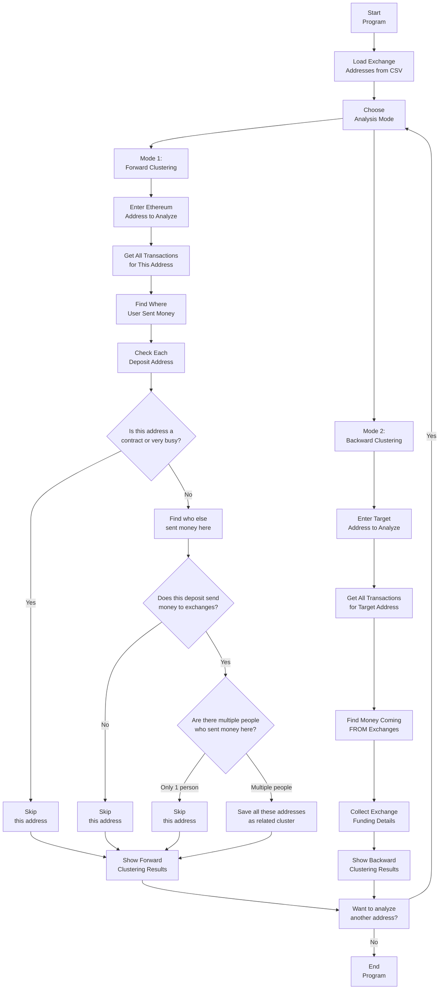

# Ethereum Address Clustering and Funding Source Analysis Tool

## Introduction

This tool helps you analyze Ethereum blockchain addresses to uncover connections and understand money flows. It offers two main analysis modes:

1.  **Forward-Clustering:** Identifies groups ("clusters") of users who might be using the same deposit address to send money to an exchange (like Binance, Coinbase, etc.). This is useful for understanding how multiple individuals might be sharing an intermediary address before funds reach a centralized exchange.

2.  **Backward-Clustering (Funding Source Analysis):** Traces the origins of funds received by a specific address, pinpointing transactions from known exchange wallets. This helps in understanding where an address has received money from, especially from exchanges.

This tool is valuable for blockchain research, anti-money laundering efforts, or simply gaining insights into transaction patterns on the Ethereum network.

---

## Features

* **Flexible Analysis Modes:** Choose between "Forward-Clustering" to find shared deposit addresses or "Backward-Clustering" to identify funding sources from exchanges.
* **Exchange Address Loading:** Automatically loads a list of known exchange addresses and their labels from a CSV file (`collected_addresses.csv`).
* **User Input:** Prompts you to enter an Ethereum address for analysis.
* **Comprehensive Transaction Fetching:** Retrieves both normal and internal transactions for a given address from the Etherscan API.
* **Intelligent Deposit Address Analysis (Forward-Clustering):**
    * Identifies all addresses to which the analyzed user sent money ("deposit addresses").
    * Checks if these deposit addresses are used by multiple senders.
    * Determines if these deposit addresses forward funds to a known exchange.
    * Filters out smart contracts (unless they are known exchanges) and high-activity addresses (e.g., popular services) to focus on individual deposit patterns.
    * Groups related addresses into "clusters" and presents detailed results, including transaction counts and total ETH amounts for each clustered user.
* **Funding Source Identification (Backward-Clustering):**
    * Analyzes incoming transactions to a target address.
    * Identifies and categorizes deposits originating from known exchange addresses.
    * Provides detailed metrics for each funding source, including transaction count, total amount, first/last seen timestamps, and an activity timeline.
* **Robust API Handling:** Implements retry mechanisms and delays to gracefully handle Etherscan API rate limits and errors.
* **Progress Tracking:** Displays progress bars during intensive analysis to keep you informed.
* **Clear and Detailed Output:** Presents analysis results in an organized and easy-to-understand format.

---

## How It Works (Step-by-Step)

### 1. **Load Exchange Addresses**
    * Reads CSV file with known exchange addresses and labels

### 2. **Select Analysis Mode**
    * Choose Forward-Clustering or Backward-Clustering

### 3. **Enter Target Address**
    * Input the Ethereum address to analyze

### 4. **Fetch Transactions**
    * Downloads all transactions from Etherscan API

### 5. **Analyze Based on Mode**

#### **Forward-Clustering**
    * Finds where your address sent money
    * Checks if others also used those same deposit addresses
    * Identifies if deposits forward to exchanges
    * Groups related addresses into clusters

#### **Backward-Clustering**
    * Finds incoming transactions from exchanges
    * Aggregates funding source details and metrics

### 6. **Display Results**
    * Shows clusters with deposit addresses, exchanges, and related users
    * Presents funding sources with transaction counts and amounts

### 7. **Continue or Exit**
    * Option to analyze another address or quit

---

## Program Flow (Visual)



---

## Setup Instructions

1. **Install Python**
   - Make sure you have Python 3.7 or newer installed. You can download it from [python.org](https://www.python.org/downloads/).

2. **Install Required Libraries**
   - Open a terminal (Command Prompt or PowerShell on Windows).
   - Navigate to the folder with the script.
   - Run:
     ```bash
     pip install requests tenacity tqdm
     ```

3. **Prepare the CSV File**
   - Make sure you have a file called `collected_addresses.csv` in the same folder.
   - This file should have at least a column for addresses, and optionally labels or exchange names.

4. **Check Your API Key**
   - The script uses a default Etherscan API key. For heavy use, get your own free key from [Etherscan.io](https://etherscan.io/myapikey) and replace the value in the script.

---

## How to Use

1. Open a terminal and navigate to the folder with the script.
2. Run the script:
   ```bash
   python etherscan_deposit_clustering.py
   ```
3. When prompted, enter an Ethereum address.
4. Wait for the analysis to complete. The tool will show you any clusters it finds.
5. Enter another address or type `quit` to exit.

---

## License

This tool is for educational and research purposes. Use responsibly!